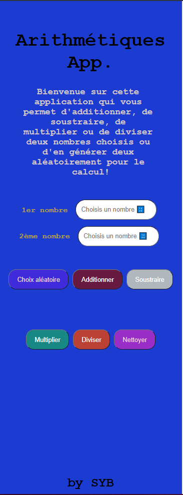
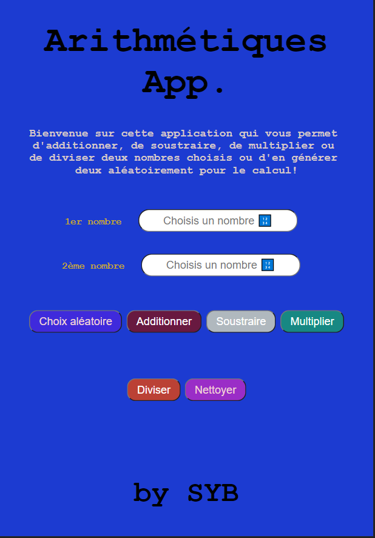
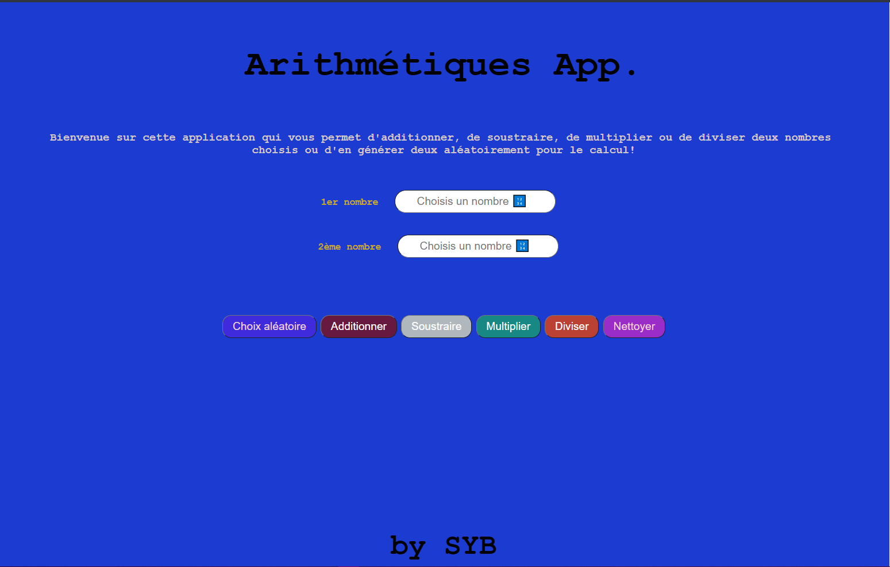

## BIENVENUE SUR CETTE APPLICATION 

### Responsive First 📱:

L'application est disponible pour différentes résolutions d'écrans afin de répondre aux plus grands nombres d'utilisateurs. 

### Objectif de cette application v2 🎯: 

- Vous permettre d'additionner, de soustraire, de multiplier ou de diviser deux nombres choisis;
- Vous permettre d'additionner, de soustraire, de multiplier ou de diviser deux nombres générer aléatoirement;
- Vous permettre d'effacer toutes les données

### Autres améliorations à venir ! 🚧  

